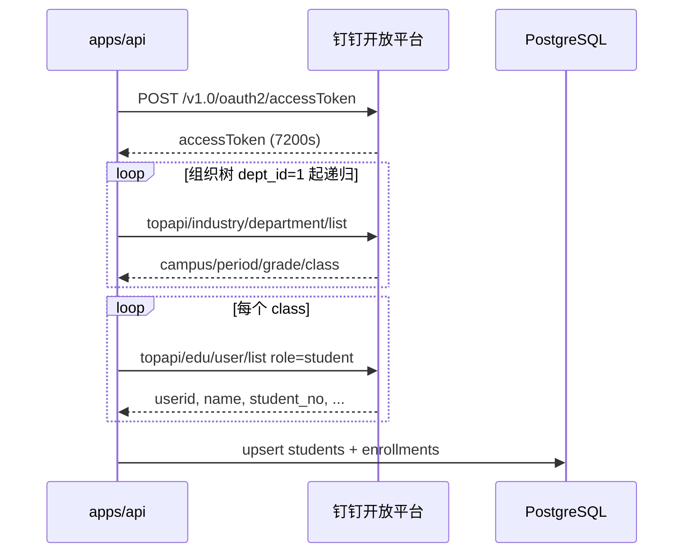

# SUIS Compass · 智能教学中心

面向学校的 **AI 辅助教学平台**（内部工程名 `curriculum-roadmap`）：从课程规划、课中执行，到学生/教师画像与学业评价，在同一 Hub 上按职责分入口。支持多角色权限、云端同步与中英界面。

---

## 设计准则（开发前必读）

**新增功能、表单或数据采集前，先对照本节。**


|                | 要点                                                                                                             |
| -------------- | -------------------------------------------------------------------------------------------------------------- |
| **大前提：学为中心**   | 以学习、学生发展为中心。功能先问是否真正帮助学生被理解与支持，而非「填表更全、界面更满」。                                                                  |
| **准则一：不搞形式主义** | 每项录入必须对应明确下游：**谁读？读后做什么？** 无用途的字段不做。例：学生分析 → 学生画像、班主任综合评价；教师 KISS 诊断 → 教师画像，不进入学生对外发布的学业报告。仅为「收集反思」而收集，视为形式主义。 |
| **准则二：勿增实体**   | **若无必要，勿增实体。** 不重复造轮子、不平行维护两套逻辑、不为排查一次性问题长期保留脚本与字段。新模块/表/接口须能说明「缺了它哪条用户路径走不通」；否则用现有域扩展。                        |


*更多准则可在实践中补充于此表。*

---

## 用户权限与岗位

**角色管大门，岗位管范围。** 新增功能时：先用 `users.role` 判断能否进入模块，再用学年岗位判断数据范围与额外入口；**不要把 role 与岗位混写在同一个 `if` 里。**

### 角色（`users.role`）

全站固定 **4 种**枚举（数据库与 API 字段名不变；界面中文名见下表）：


| 枚举值            | 界面中文名   | 定位                   |
| -------------- | ------- | -------------------- |
| `system-admin` | 系统管理员   | 最高治理权限               |
| `admin`        | 管理员     | 日常教务治理               |
| `teacher`      | **教职工** | 业务使用账号（不进后台）         |
| `student`      | 学生      | 仅学生画像本人视图（保留，便于后续扩展） |


> `teacher` 在代码中仍写作 `teacher`，界面统一显示为 **教职工**，避免与「学生账号」混淆，也覆盖非任课岗位人员。

### 能力（由 role 推导）

不在 `users` 表上为每种业务再增 role；下列能力由 role **推导**，前后端应集中复用同一套判断：


| 能力                    | `system-admin` | `admin` | `teacher` | `student` |
| --------------------- | -------------- | ------- | --------- | --------- |
| 进入后台管理                | ✓              | ✓       | —         | —         |
| 新建学年、升学年等学年结构变更       | ✓              | —       | —         | —         |
| 管理教职工账号（创建 `admin`）   | ✓              | —       | —         | —         |
| 管理教职工账号（创建 `teacher`） | ✓              | ✓       | —         | —         |
| 进入 Hub 与业务模块          | ✓              | ✓       | ✓         | —         |
| 学生画像（仅本人）             | —              | —       | —         | ✓         |


**说明**

- **系统管理员**：由部署/初始化产生；可进后台；可新建学年、升学年、课程河流写操作、组织架构变更等关键功能。
- **管理员**：由系统管理员创建；可进后台处理班级、岗位、模板、用户等日常治理；**学年结构操作为只读**（不可新建学年、升学年）。
- **教职工**：不进后台；从 Hub 进入课程河流、学生/教师画像、学业报告、公开课等；课堂助手在 **更多功能** 里。**具体可见范围与额外入口由岗位安排决定**。
- **学生**：不进 Hub；仅登录学生画像查看与本人相关的已发布数据。

### 岗位（按学年 + 范围，可扩展）

学科组长、年级组长、班主任、任课教师等 **不是** `users.role`，而在后台 **岗位安排**（及班级班主任任命）中按 **学年** 维护，每年可换届。

岗位只回答：「本学年负责哪段范围、多哪些读写入口？」例如：

- 班主任 → 班级综合评价、本班学情相关入口
- 任课教师 → 任教学科报告填写
- 学科组长 / 年级组长（规划）→ 对应学科层 / 年级层督办视图、组内进度汇总

岗位类型与权限清单随功能迭代补充；**若无必要，勿为每种组长新增 role**。

### 鉴权顺序（实现约定）

1. **Role**：能否访问后台、能否进 Hub、能否改学年结构等「大门」。
2. **岗位**：在已通过大门的前提下，计算数据 scope（年级、学科、班级列表）与增量入口。

---

## 产品总览：Hub 与主要功能

从主界面（Hub）进入各模块。**先判断数据最终服务学生还是服务教师**，再决定入口与存储归属（详见下表「数据归属」列）。


| Hub 入口 / 模块 | 主要目的                                       | 谁在用               | 数据归属                 |
| ----------- | ------------------------------------------ | ----------------- | -------------------- |
| **学生画像**    | **看**各层级学生数据（全校 → 年级/平行班 → 班级 → 个人），汇总长期发展 | 教师、班主任、管理员；学生只看本人 | **学生域**：采集也由此闭环      |
| **教师画像**    | **看**各层级教师数据（全校 → 学科/年级 → 个人），支持反思与专业成长    | 教师本人、教研组、管理员      | **教师域**：采集也由此闭环（演进中） |
| **提醒事项**    | 主界面左上角长格：未完成的学业报告与教师任务在上，今日和明日公开课在下     | 教职工、管理员           | 汇总已有任务与公开课，不另存一份     |
| **学业报告**    | 按学期/模板录入学科评价、班主任评语等（Hub 快捷入口）              | 任课教师、班主任          | 学生域录入 → 回流**学生画像**   |
| **课程河流**    | 建设与管理全校课程：单元、关键概念、多视图浏览                    | 教师、管理员            | 教学资源域；与学段年级配置联动      |
| **公开课**     | 按学年学期登记组内公开课、日常课、校级公开课；可导入导出 Excel       | 教职工；学科组长可代本组；管理员可代任何人 | 学科组过程记录               |
| **更多功能**    | 收纳不那么常用的入口；第一项是 **课堂助手**                   | 教职工               | 只是入口文件夹，数据仍在各模块      |
| **课堂助手**    | 课中执行：个人/小组积分、分组方案（从更多功能进入）                 | 任课教师              | 课堂过程域；若纳入画像需显式对接学生画像 |
| **后台管理**    | 学校治理：账号、学年班级、岗位、报告模板、基础设置等                 | 系统管理员、管理员         | 配置域，不替代画像内的读与写       |
| **AI 助手**   | 跨场景对话与生成（单元、课程上下文等）                        | 教职工               | 消费各域已沉淀数据，不定义归属      |


**一句话归属**：描述**学生**、服务对学生的支持 → **学生画像**；描述**教师自己的教与成长** → **教师画像**。

### 学生画像：看什么、填什么

- **看**：学业趋势、多框架发展视图（学业、兴趣特长、通用学习力、社会情感等，持续扩展）。
- **填**：凡最终丰富学生画像的采集都从这里进——如**学业报告**、学生相关**问卷**、班内学情类记录；录入后在画像按层级**读回、汇总、分析**，形成闭环。
- **说明**：学业报告是画像的**重要数据来源之一**，不是画像的全部；Hub 可直达「学业报告」填表，但闭环仍在学生画像。

### 教师画像：看什么、填什么

- **看**：教师个体与群体（学科、年级等）的专业发展视图。
- **填**：凡服务自我反思与成长的采集都从这里进——如**阶段教学诊断（KISS）**、听评课与教研记录（规划）；**不**因报告季挂在学生学业报告流程里。

### 课程河流（能力摘要）

课程与单元 CRUD、协和色系与周课时、Excel 导入、拖拽排序；**整体 / 单元 / 概念**视图与力导向图；AI 生成单元、教材 PDF/TXT、多模型可选；本地缓存 + 云端同步、按用户隔离。

### 课堂助手（能力摘要）

班级内积分事件、分组方案与小组管理；可与后台班级、学生数据云端联动。入口在 Hub **更多功能** 的第一格。

---

## 技术栈


| 层级  | 技术                                                           |
| --- | ------------------------------------------------------------ |
| 前端  | React 19 + TypeScript、Vite、Tailwind CSS + shadcn/ui、中/英 i18n |
| 后端  | Node.js + Express                                            |
| 数据  | PostgreSQL（如 Zeabur Neon）                                    |
| 其他  | pdfjs-dist、HTML5 Canvas（概念网络图）                               |


---

## 工程说明

### 项目结构（Monorepo）

```
├── apps/web/      # 前端
├── apps/api/      # 后端（托管 web 构建产物）
├── libs/shared/   # 共享类型与常量
└── package.json
```

### 数据流

- **写入**：操作 → 本地缓存 →（可选）API → PostgreSQL（JWT；开发联调可暂用 `X-User-Id`）。
- **读取**：云端模式优先 API；纯本地模式（`VITE_USE_CLOUD_STORAGE=false`）走 localStorage。
- **隔离**：用户私有设置按用户键隔离；班级、学生、课程、报告等为全校共享业务数据（权限控制读写）。

### 本地开发与构建

**环境**

- 仅前端：`apps/web/.env` 中 `VITE_USE_CLOUD_STORAGE=false`，无需 API。
- 联调后端：`VITE_USE_CLOUD_STORAGE=true`，`VITE_API_URL`（如 `http://127.0.0.1:8080/api`）；`apps/api/.env` 配置 `DATABASE_URL`、`JWT_SECRET`。

**数据库（Docker）**

```bash
npm run db:up && npm run db:init   # 结构见 apps/api/src/config/init.sql
```

**常用命令**

```bash
npm install          # Node.js ≥ 20
npm run dev          # shared + API:8080 + Vite
npm run dev:web      # 仅前端
npm run dev:api      # 仅后端
npm run build && npm start
```

---

## 版本与状态

主版本记录平台能力；**0.4.x** 线主要迭代学业报告与后台治理；**0.5.x** 线聚焦**升学年**、**学生管理外部同步**与学年切换能力；**0.6.x** 线先完成课程河流，再展开学科组管理工具。版本号主段从 **0** 起计，表示产品仍在开发中、尚未发布 1.0。

**npm 包版本**（根目录与各 workspace 的 `package.json` 中 `version`）与下表产品版本保持一致。


| 状态            | 版本        | 分支    |
| ------------- | --------- | ----- |
| **已发布（`main`）** | **0.6.5** | —     |
| 上一版           | **0.6.0** | —     |


上线前：`npm run build` 与联调；清单见 `[docs/上线注意事项.md](docs/上线注意事项.md)`。

版本历史（点击展开）

- **0.1** — 课程河流雏形：课程、单元、基础可视化。 云端同步、AI 生成单元、Excel 导入。
- **0.1.1** — 全局 AI 助手。
- **0.2** — 后台管理、角色权限。
- **0.3** — 课堂助手、Hub 布局。
- **0.4** — 学生账号、学生画像、学业报告、班主任岗位、全校共享数据。
- **0.4.1** — 学段年级、课程视图统一、组织岗位、`init.sql` 基线。
- **0.4.2** — 学年维度预设、考试学科、教师评价表合一。
- **0.4.3** — 基础设置合并、领域聚类、岗位 Excel、压测工具。
- **0.4.4** — **学业报告**：考试等第改为「总分 + 得分率（%）」换算，适配不同满分；学年模块化配置统一参评/考试年级判定，修复发布后 phantom 学科、G1–2 泄分、教师端与后台不一致等问题；分年级维度快照与英语 ELA 进度按年级解析。**教师画像**：Hub 入口、采集表/KISS 诊断、管理员配置与只读查看。**后台**：班级管理并入基础设置（学年管理 → 学段与年级 → 班级管理 → 组织架构），移除重复顶栏；学校看板「学部分布」按学段设置归类。**压测**：小学/初中学业报告多轮压测与三层一致性复查；脚本适配非 100 满分。**文档**：README 重构（设计准则、Hub 产品总览表）；`docs/上线注意事项.md`。
- **0.4.5**— **教师画像**：学科看板重构（学科组 / 全体学科、学业报告年级×班级矩阵、教学诊断 KISS 按教师双列展示）；Hub 待办格子常驻（空态「暂无待办」）。**后台 · 岗位安排**：拆为年级管理、教学管理、课程岗位、周课时统计；功能岗位（年级组长 / 学科组长）与教学学科组配置，`init.sql` 增补 `functional_role_assignments`、`teaching_subject_group_members` 等基线。**学业报告**：修复学生画像「测评成绩」不显示（报告 bundle 补全模板学年/学期/学段元数据）；学科看板合并仅有分数数据的学科；模板停发后可从 `draft`/`closed` 再次发布。**课程河流**：标签入口与基础设置/岗位安排统一（协和蓝 `SegmentTabButton`、学段+整体 / 单元 / 概念三组）；Hub 与后台共用工具条；主界面贴左铺满、列宽与单元视图周列自适应，尽量避免横向滚动。**文档与整洁**：README 增补「用户权限与岗位」、准则二「勿增实体」；移除一次性压测脚本与 `GradeSettingsDialog` 重复入口。
- **0.5.0**— **升学年**：系统管理员执行前弹出预览（概览 / 班级与学籍 / 岗位安排 / 职能岗位 / 不变项），确认后升班、迁岗、毕业归档；`@repo/shared` 统一班名升位与学段毕业判定；API 与 `init.sql` 增补归档字段。**Hub**：入口更名为 **学生中心** / **教师中心**（英文 Student Center / Teacher Center）。**后台顶栏**：用户管理 → 学生管理 → 基础设置 → 课程管理 → 岗位安排 → **周课时统计**（独立顶栏）→ 学生画像 → 教师画像 → 数据库。**岗位安排**：年级 / 教学 / 课程岗位三子标签，右上角统一学年选择与 Excel 整包导入导出（年级管理全校合并单 sheet，兼容旧版多 sheet）；周课时统计独立导出。**课程数据**：全校共享 holder，课程管理保留 JSON 整包导入导出。**学生管理**：Excel 导入/导出（无学生时导出空模板），学年选择并入工具栏；移除「学生登录」「创建学生」入口。**基础设置**：班级管理去掉重复「当前学年」行（列表标题已展示学年）。**文档**：README 版本号主段统一改为 0.x（开发中，未到 1.0）。
- **0.5.1**— **钉钉学生同步**：家校/行业通讯录拉取组织树与学生名单；校区过滤（协和、排除选课测试）；班级名映射（含初中 `grade_level` 修正）；确认式差异同步与学号自动生成；后台 **数据库 · 钉钉 API** 与 `repair-classes`；压测 `--fast` 与班科分析校验优化。**后台**：周课时统计工具栏合一；学生管理钉钉链路。**文档**：[docs/钉钉学生数据同步.md](docs/钉钉学生数据同步.md)。
- **0.5.2**— **SUIS AI 侧窗**：学生中心、教师中心（含学科看板/全校成绩）顶栏 Bot 入口；桌面侧栏 **45%** 宽（原 50%）；AI 回复支持 Markdown 表格。**AI 上下文**：随当前标签页同步班级/学生学情或学科看板均分；考试学科**满分按所选学业报告与学期**解析（如科学 50），均分与趋势带得分率。**学生中心**：年级组长可见本年级各班与学生；班主任/任课/组长考试趋势与学科报告权限修复；学生个人概览面板。**教师中心**：学科组长在学科看板侧窗分析年级×班级数据。**部署**：PostgreSQL SSL（Neon/Zeabur）、Zeabur 部署示例；课程数据云端 API。**文档/品牌**：产品名 **SUIS Compass**，Hub 表「AI 助手」面向教职工。
- **0.5.3**— **升学年**：支持**撤回升年**（系统管理员，学年管理对话框内）；预览与执行逻辑补强（班级/学籍/岗位/选修自习等一并迁移）。**岗位安排 · 课程岗位**：新增**自习模块**与**选修课**排课与任课配置，Excel 整包导入导出扩展。**学生中心**：班主任「我的学生」支持**分学生导出**（每人一份 PDF 打包 ZIP）与**导出为一份文件(打印)**（全班合并 PDF）。**教师中心 · 教师发展**：教学诊断选择改为学年 → 学期 → 诊断三级下拉，与学业报告一致；默认选中最近发布且未完成的诊断。**压测**：JWT 真实登录；`load:report:teacher` / `load:report:grade` / `load:report:school` 单教师至全校链路；`export:load-credentials` 导出本地账号；修复线上测评成绩维度。**后台**：教师画像采集管理增强；「撤回升年」移入学年管理对话框。**Hub**：拖拽编辑时修复 `aria-hidden` 焦点告警。
- **0.6.0**— **课程河流**：登录/换设备后从 `GET /api/curriculum/export` 预热学期缓存，格子按是否有单元正确着色，避免必须先点开学期；单元 `keyConcepts` 缺省时补空数组，防止首点白屏。**教材目录**：语文 G1–9（人教部编）与数学 G1–6 苏教 / G7–9 沪科 可按学期写入数据库（`tools/curriculum-seed/`，上线后对生产 API 再跑一遍）。
- **0.6.5**— **公开课**：组内公开课、日常课、校级公开课；列改为学期-单元-课题，并增加班级。按当前学年学期导入/导出 Excel（双语标题与表头，含全部类型）。组内与校级课全校教职工可见；日常课只给创建者和上课教师。校级课仍仅学科组长与管理员可新建。**Hub**：提醒事项扩为宽 2 格，未完成报告和教师任务在上，今日、明日公开课在下，格式如「今天 09:00 英语 Alana P1A(录播教室)」。教师中心改为 1×1；课堂助手收进右下角 **更多功能**。空格子仍显示为浅灰占位。默认布局：提醒事项在左上角，更多功能在右下角。

---

## v0.6.5：公开课、提醒事项与更多功能（已发布）

**目标**：把学科组的公开课登记做完整，并让主界面能直接看到近两天的课。

| 模块 | 能力 |
|------|------|
| **公开课** | 三种类型：组内公开课、日常课、校级公开课。列：组别、教师、班级、日期、时间、学期-单元-课题、上课地点、备注 |
| **Excel** | 导入、导出当前学年学期的全部类型。首行双语标题「202x-202x 第x学期 合肥协和公开课安排表」（蓝底白字）；第二行双语表头（淡灰底黑字） |
| **可见范围** | 组内、校级：全校教职工可见。日常课：仅创建者与上课教师。管理员不因角色看到别人的日常课 |
| **填写权限** | 教职工登记自己所在学科组的课；学科组长可登记本组组员；管理员可登记任何人。校级公开课仅学科组长与管理员可新建 |
| **提醒事项** | 宽 2 高 1，默认在主界面左上角。未完成的学业报告与教师任务在上；今日、明日公开课按时间由近到远排在下面。公开课一行：开始时间、学科、教师、班级(上课地点) |
| **更多功能** | 默认在右下角。进入后以同样的格子展示不常用功能，第一项是原来的课堂助手 |
| **主界面** | 教师中心为 1×1。未被功能占用的格子仍显示为空格子 |

实现要点：`open_lessons.lesson_kind` 与 `created_by`；导入替换当前学年学期中**自己能看见**的行，看不见的日常课保留。时间仍是文本（如 `09:00-09:40`），提醒里只显示开始时间。学科取自学科组名称（「小学英语组」显示为「英语」）。Hub 布局存在本机，版本键更新后各账号回到上述默认位置。

---

## v0.6.0：课程河流云端着色与语文/数学目录（上一版）

**目标**：新设备打开课程河流即可看到已填学期，并补齐语文、数学 G1–9 单元目录。

| 模块 | 能力 |
|------|------|
| **课程河流** | 首次加载并行拉取全校学期数据写入缓存；格子深浅色与云端占用一致 |
| **学期弹窗 / 单元 / 概念视图** | 缺字段时不再白屏；关闭弹窗后立刻刷新占用色 |
| **教材种子** | `tools/curriculum-seed/seed_chinese_pep_g1_9.py`、`seed_math_g1_9.py`；按课程名查找，可用 `SUIS_API_URL` 指向生产 |

实现要点：`hydrateSemesterCacheFromCloud`；`normalizeUnit` 补齐 `keyConcepts`；学期写入仍走 `POST /api/semester`（一次一学期）。上线后语文/数学内容需对**生产库**再执行种子脚本（课程 id 随环境而变，脚本按课程名匹配）。**勿**用课程 JSON 整包导入覆盖生产，以免冲掉已有课程。

---

## v0.5.3：升学年撤消、课程岗位与导出体验（已发布）

**目标**：完善学年切换闭环，扩展课程岗位排课能力，并统一教师/学生报告类界面的选择与导出体验。

| 模块 | 能力 |
|------|------|
| **升学年** | 系统管理员可在学年管理对话框**撤回升年**；预览覆盖班级、学籍、岗位、选修/自习等 |
| **岗位安排 · 课程岗位** | 自习模块排课、选修课任课配置；与周课时统计、Excel 整包联动 |
| **学生中心 · 我的学生** | 班主任导出全班学业报告：**分学生导出**（ZIP）/ **导出为一份文件(打印)** |
| **教师中心 · 教师发展** | 学年 → 学期 → 教学诊断三级下拉；默认最近发布且未完成的诊断 |
| **压测** | JWT 登录；单教师 / 年级 / 全校学业报告链路；本地账号导出 `export:load-credentials` |

实现要点：`academicYearPromotion` 撤消与迁移扩展；`SelfStudyStaffingPanel` / `ElectiveStaffingPanel`；`StudentPortrait` PDF + `jszip`；`TeacherPortraitCollectionFill` 筛选器与 `pickPreferredPublishedTask`；`tools/load-tests/` JWT 与分档脚本。

---

## v0.5.2：SUIS AI 侧窗与学情上下文（已发布）

**目标**：在业务页面内直接打开 SUIS AI，让模型基于**当前屏幕上的结构化数据**分析学情，而非仅通用对话。

| 模块 | 能力 |
|------|------|
| **学生中心** | 班级整体 / 学生个人视图同步分数、趋势、评语；满分随所选学业报告与学期变化 |
| **教师中心 · 学科看板** | 全校或学科组年级×班级均分；切换学业报告后满分与均分上下文一并更新 |
| **Hub · SUIS AI** | 全屏入口；可手动选择「学生中心 / 教师中心 / 课程河流」基础上下文（无页面明细） |

实现要点：`AIPanel` + `AIContext`；`studentPortraitAIContext.ts` / `teacherPortraitAIContext.ts`；`remark-gfm` 表格渲染。侧栏布局见 `App.tsx` 中 `AI_DOCK_*` 常量。

---

## v0.5.1：钉钉学生数据同步（已发布）

**目标**：后台 **学生管理** 以钉钉家校通讯录为外部主数据源，定时或手动同步至 PostgreSQL（`students`、`student_enrollments`），减少 Excel 手工维护。

### 应用凭证（非密钥）

| 项 | 值 |
|----|-----|
| App ID | `be33be8e-8e61-49c4-8d05-21b112176065` |
| AgentId | `4378680629` |
| Client ID（原 AppKey） | `dingmgcy0tkwjhib5eww` |

**Client Secret** 仅配置在 `apps/api/.env` 的 `DINGTALK_CLIENT_SECRET`（见 `apps/api/.env.example`），**勿写入 Git 或 README**。若曾在聊天/文档中暴露，请在钉钉开发者后台轮换。

### 调用链路（摘要）



| 步骤 | 接口 | 说明 |
|------|------|------|
| 1 | `POST api.dingtalk.com/v1.0/oauth2/accessToken` | 用 Client ID + Secret 换 token，服务端缓存 |
| 2 | `POST oapi.dingtalk.com/topapi/industry/department/list` | 从 `dept_id=1` 遍历，`dept_type=class` 为班级 |
| 3 | `POST oapi.dingtalk.com/topapi/edu/user/list` | `role=student`，按 `class_id` 分页拉学生 |
| 4 | 本地写库 | 映射 `userid` → 学生、`class_id` → 学籍（实现中） |

权限：需在钉钉应用后台开通 **家校通讯录读**、**行业通讯录** 等相关 scope（见集成文档）。

### 钉钉班级与本地班名对应

钉钉家校通讯录中的中文班级名，需映射为本系统 **当前学年** 下已存在的班名：

| 学段 | 班名格式 | 示例（钉钉 → 本地） |
|------|----------|---------------------|
| **小学**（1–6 年级） | `P` + 年级数字 + 班别字母 | 三年级1班 → **P3A**，三年级2班 → **P3B** |
| **中学**（7–12 年级） | `S` + 年级数字 + 班别字母 | 七年级1班 → **S7A**，八年级1班 → **S8A** |

- **班别字母**：1班→A，2班→B，3班→C，4班→D，5班→E，**6班→G**（跳过 F），7班→H…（最多到 Z）。
- 解析规则：从钉钉 `年级名 + 班级名`（如「八年级」「1班」）或 `feature.grade_level` 取年级；从班级名中的数字/字母取班别。
- **前提**：`基础设置 → 班级管理` 中当前学年已建好对应班（如 S8A）；若本地无该班，同步时会标记「无法匹配」，该项不可勾选新增。

### 推荐同步流程

1. **刷新**：后台 → **数据库** → **钉钉 API** → 点击 **刷新**（拉取钉钉最新学生，不自动写库）。
2. **同步**：点击 **同步学生数据**，系统对照当前学年本地学籍，列出 **新增 / 更新 / 删除** 建议；**每项需单独勾选** 后确认执行。
3. **字段**：钉钉提供的 userid、姓名、学号（班级已配置时）、年级/入学年份（组织树推导）会写入；**性别、生日** 钉钉不提供，本地留空（`gender` 暂记 `other`）。

实现：`apps/api/src/services/dingtalk/classNameMapping.ts`、`syncPlan.ts`、`syncApply.ts`；`students.dingtalk_user_id` 用于后续增量匹配。


## 文档与协作

- **产品与架构说明**：以本 README 为准（设计准则 + 产品总览表）。
- **架构与协作约定**：[docs/智能教学中心设计指南.md](docs/智能教学中心设计指南.md)（细则；不与 README 重复维护产品说明）
- **钉钉学生同步（v0.5.1）**：[docs/钉钉学生数据同步.md](docs/钉钉学生数据同步.md)
- **上线**：[docs/上线注意事项.md](docs/上线注意事项.md)
- **学业报告压测**：[tools/load-tests/README.md](tools/load-tests/README.md)
- **扩展开发**：遵循数据归属、[用户权限与岗位](#用户权限与岗位)约定；**若无必要，勿增实体**（见设计准则）。

